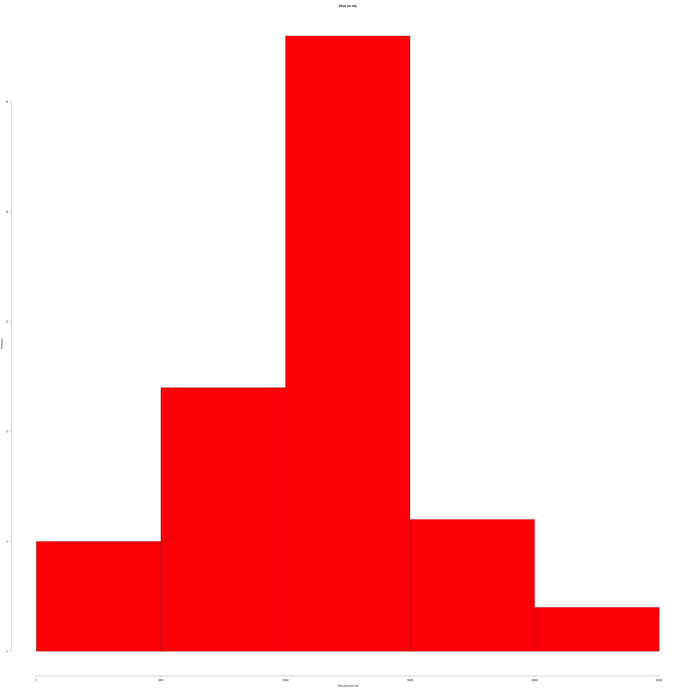
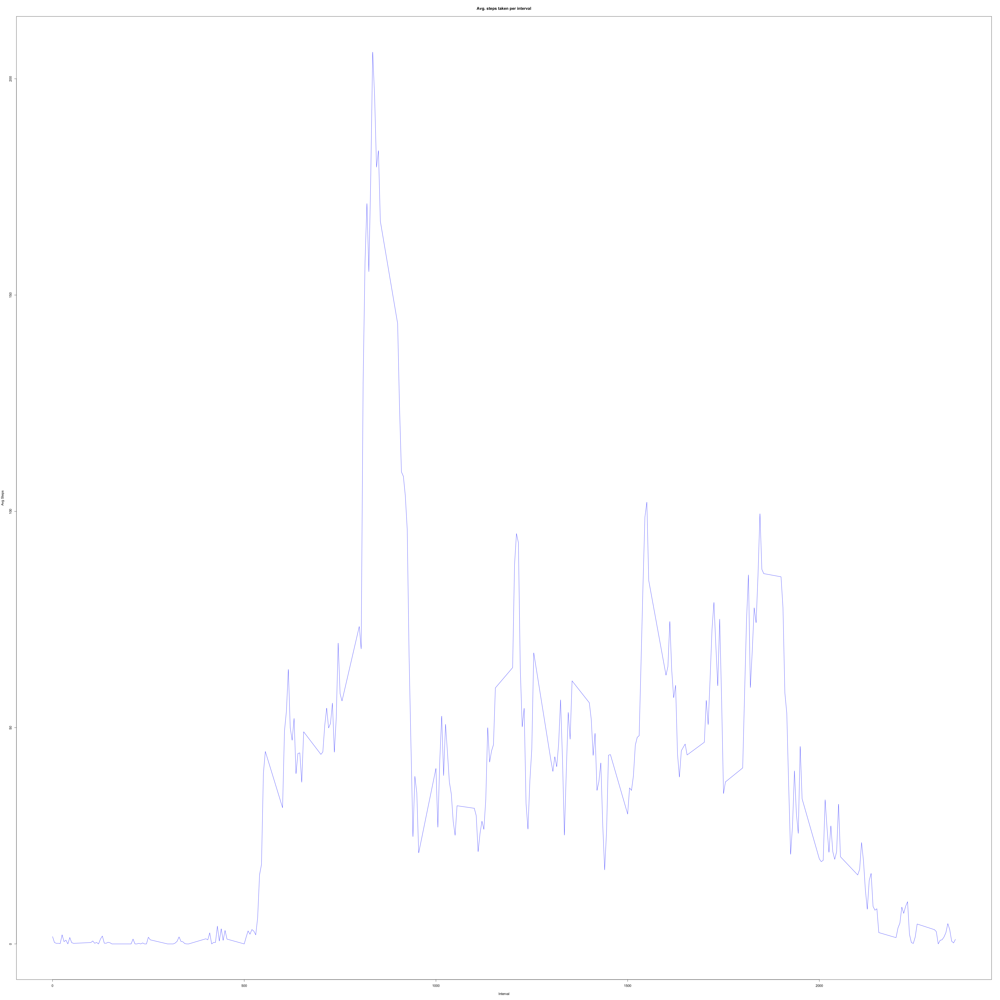
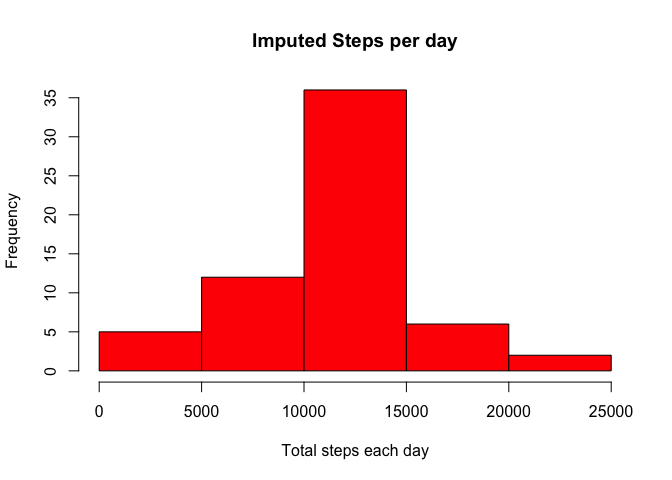

# Reproducible Research: Peer Assessment 1


## Loading and preprocessing the data
The `dplyr` package is being used here to process the data better. 

```r
library(dplyr)
```

```
## 
## Attaching package: 'dplyr'
## 
## The following object is masked from 'package:stats':
## 
##     filter
## 
## The following objects are masked from 'package:base':
## 
##     intersect, setdiff, setequal, union
```

The data is then read from the csv file. 

```r
activity = read.csv("activity.csv")
```


## What is mean total number of steps taken per day?
`dplyr` has a `group_by` function which can be used to find the total number 
of steps taken per day. The observations which don't have a steps are removed
for this. 


```r
steps_by_date <- activity %>%
  filter(!is.na(steps)) %>%
  group_by(date) %>%
  summarize(total_steps = sum(steps))
```

The `steps_by_date` variable produced in the previous step is then used to 
plot a histogram. 


```r
hist(steps_by_date$total_steps, col = 'red', xlab = "Total steps each day", 
     main = "Steps per day")
```

 

The mean and median are taken on the total_steps column

```r
mean(steps_by_date$total_steps)
```

```
## [1] 10766.19
```

```r
median(steps_by_date$total_steps)
```

```
## [1] 10765
```

## What is the average daily activity pattern?
Finding the average steps taken across all intervals :


```r
steps_by_interval <- activity %>%
  filter(!is.na(steps)) %>%
  group_by(interval) %>%
  summarize(avg_steps = mean(steps))
```

Plot a time series plot of the 5 minute interval and the average number of steps.


```r
plot(steps_by_interval$interval, steps_by_interval$avg_steps, type = "l",
     col = "blue", xlab = "Interval", ylab = "Avg Steps", 
     main = "Avg. steps taken per interval")
```

 

Filtering by the interval which would have the maximum number of steps. 
This is then printed out to give the interval (along with the avg steps.)

```r
max_interval <- steps_by_interval %>%
  filter(avg_steps == max(avg_steps))
max_interval
```

```
## Source: local data frame [1 x 2]
## 
##   interval avg_steps
## 1      835  206.1698
```

## Imputing missing values
Calculating the rows which have missing values for steps.


```r
empty_steps <- activity %>%
  filter(is.na(steps))
nrow(empty_steps)
```

```
## [1] 2304
```

To do the imputing, 
* First separate out the values which are complete.
* Next calculate the average by interval
* Join this with the empty steps by interval. 
* Mutate empty steps to make steps the average steps by interval
* Remove the average steps column. 


```r
complete_steps <- activity %>%
  filter(!is.na(steps))
complete_steps_avg <- complete_steps %>%
  group_by(interval) %>%
  summarize(avg_steps = mean(steps))
empty_steps <- empty_steps %>%
  inner_join(complete_steps_avg, by = "interval") %>%
  mutate(steps = avg_steps) %>%
  select(-avg_steps)
complete_activity <- bind_rows(complete_steps, empty_steps)
```

Now calculating the steps by day again in the merged result and drawing the 
historgram. 

```r
complete_steps_day <- complete_activity %>%
  group_by(date) %>%
  summarize(total_steps = sum(steps))
hist(complete_steps_day$total_steps, col = 'red', xlab = "Total steps each day", 
     main = "Imputed Steps per day")
```

 

```r
mean(complete_steps_day$total_steps)
```

```
## [1] 10766.19
```

```r
median(complete_steps_day$total_steps)
```

```
## [1] 10766.19
```

To find the difference in total steps, the difference from the `complete_steps`
and `complete_activity` are calculated

```r
sum(complete_activity$steps) - sum(complete_activity$steps)
```

```
## [1] 0
```

## Are there differences in activity patterns between weekdays and weekends?
